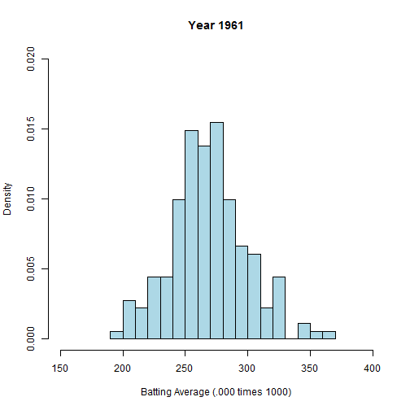

---
title       : Baseball Averages By Year
subtitle    : For Interactive Analysis, using Shiny
author      : Rick Walsh
job         : Developing Data Products
framework   : io2012        # {io2012, html5slides, shower, dzslides, ...}
highlighter : highlight.js  # {highlight.js, prettify, highlight}
hitheme     : tomorrow      # 
widgets     : []            # {mathjax, quiz, bootstrap}
mode        : selfcontained # {standalone, draft}
knit        : slidify::knit2slides

---  

## Baseball Database and Analysis

1. Lahman provides raw data 
2. Includes data such as Games, At Bats, Hits, HR's and more
3. But provides no means for easy graphical display
4. Introduce use of Shiny features to Lahman database
5. Adds graphing capabilities to raw data
6. Interactive nature of features allow for customized analysis  

--- .class #id 

## Example Data

1. Sample data for four players from 1961 data set
2. Includes ID, Games, At Bats, Hits and others, as shown

```r
library(Lahman)
# subset for players with 200 or more AB per season
sBatting <-subset(Batting, AB >= 200 & yearID==1961)
# add in the Average column
sBatting$avg <-  1000 * round (sBatting$H / sBatting$AB , 3) 
# display some sample data
sBatting[1:4,c(1,2,6,8,10,13,14,25)]
```

```
##       playerID yearID   G  AB   H HR RBI avg
## 15   aaronha01   1961 155 603 197 34 120 327
## 313  adairje01   1961 133 386 102  9  37 264
## 486  adcocjo01   1961 152 562 160 35 108 285
## 1145 allisbo01   1961 159 556 136 29 105 245
```

--- .class #id 

## Histogram of Batting Averages for a Given Year
Shiny app includes slider for year selection, as well as check boxes for average and median

 

--- .class #id 

## Extending the Concept

1. Additional graphs and plots for other relavent statistics can be provided
2. Pitching, hitting, fielding and other statistics available for analysis
3. Interactive features in Shiny allow for customization as in this example
4. Countless possibilities!


